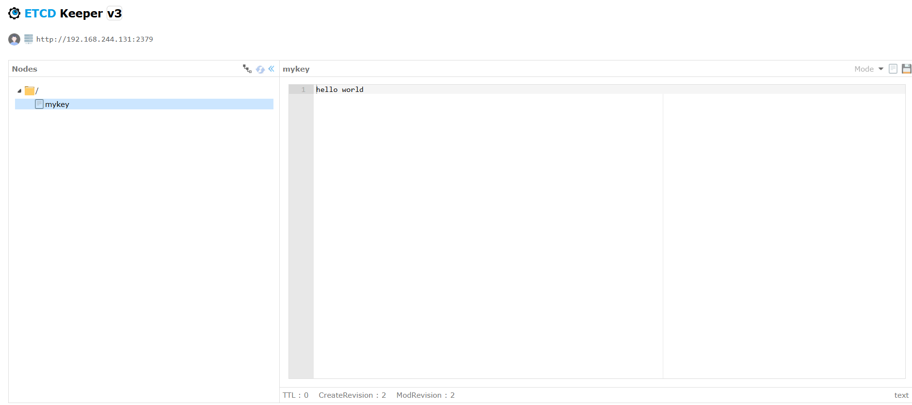
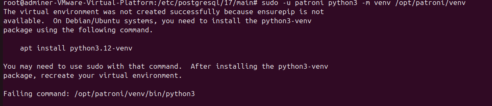
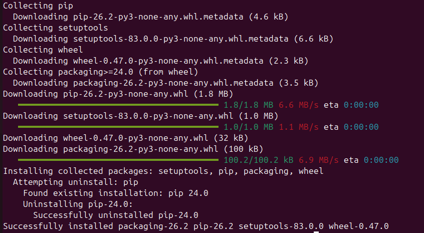
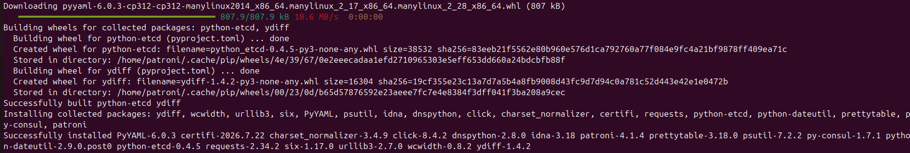
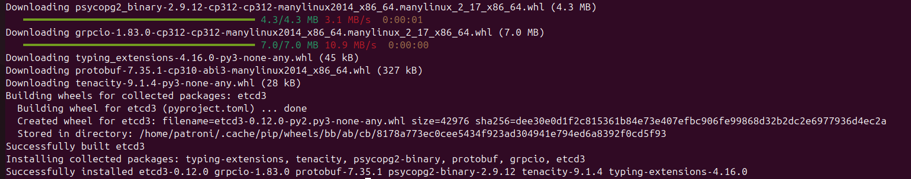
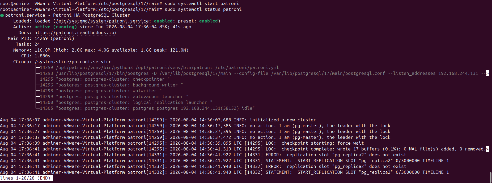
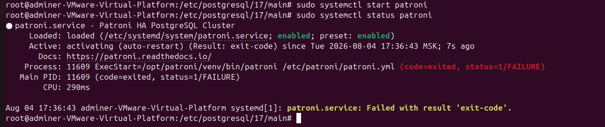
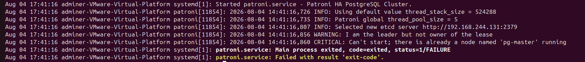
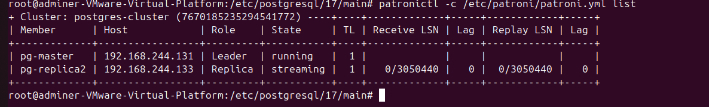
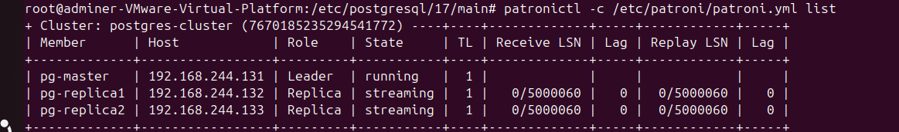

## Курс: OTUS – PostgreSQL для администраторов баз данных и разработчиков
### Проектная работа по теме:
### Создание и тестирование высоконагруженного отказоустойчивого кластера PostgreSQL на базе Patroni

### Цели и задачи:
## 1. Цель - Разработать и развернуть отказоустойчивый кластер PostgreSQL 17

## 2. Задачи:
1. Спроектировать архитектуру кластера
2. Создать и настроить 3 виртуальные машины на ОС Ubuntu
3. Развернуть кластер etcd (3 узла)
4. Установить и подготовить PostgreSQL для дальнейшей настройки Patroni
5. Настроить Patroni для управления PostgreSQL (автоматический failover, репликация, восстановление).
6. Настроить балансировку нагрузки через HAProxy
7. Настроить Keepalived
8. Провести функциональное тестирование кластера (создание БД, репликация, failover).

## 3. Используемые технологии
| Элемент | Версия | Функционал |
| --- | ------- | ----- |
| PostgreSQL | 17.10 | СУБД |
| Patroni | 4.1.3 | Управление кластером PostgreSQL |
| Etcd | 3.5.16 | Распределённое хранилище конфигураций |
| haproxy | Ubuntu 24.04.3 LTS | Операционная система + ВМ |
| VIP PostgreSQL | 2.2.8 | Отказоустойчивый VIP для HAProxy |

## 4. Архитектура кластера


4.1 Компоненты
| Элемент | Адрес | Функционал |
| --- | ------- | ----- |
| pg-master | 192.168.244.131 | Мастер PostgreSQL |
| pg-replica1 | 192.168.244.132 | Реплика PostgreSQL |
| pg-replica2 | 192.168.244.133 | Реплика PostgreSQL |
| etcd | 131/132/133 | 3 узла etcd |
| Keepalived | 192.168.244.140 | Плавающий ip адрес, живет на одной ноде |
| HAProxy | 131/132/133  | Балансировщик |
| Docker + Portainer | 192.168.244.131 | GUI для элементов |

## 5. Настройка linux машин
Единственная проблема, с которой столкнулся при настройке кластера, это меняющийся ip у виртуальных машин, что не очень удобно, поэтому делаем адреса статическими.
Проделываем на каждой ВМ.


Больше ничего настраивать не нужно, в этом и заключается удобство виртуальных машин, все уже есть из коробки.

## 6. Настройка etcd

В общем случае etcd кластер это:
Создать пользователя etcd(1) -> Создать папки и дать права(2) -> Скачать и распаковать бинарники(3)  -> Написать конфиг ноды(4) -> Написать сервисный файл(5) -> Запустить кластер(6)

6.1 Создаем пользователя 
```bash
sudo useradd -r -s /usr/sbin/nologin -M etcd
```
6.2. создаем директории 
```bash
sudo mkdir -p /opt/etcd/3.5.16/{bin,data,logs,scripts}
```
6.3. создаем переменную окружения
```bash
ETCD_VER="v3.5.16"
```
6.4. скачиваем бинарники
```bash
wget https://github.com/etcd-io/etcd/releases/download/${ETCD_VER}/etcd-${ETCD_VER}-linux-amd64.tar.gz
```
6.5. устанавливаем
```bash
tar xzvf etcd-${ETCD_VER}-linux-amd64.tar.gz
```
6.6. перемещаем в нужную директорию
```bash
sudo cp etcd-${ETCD_VER}-linux-amd64/etcd* /opt/etcd/3.5.16/bin/
```
6.7. выдаем права и на запуск
```bash
sudo chmod +x /opt/etcd/3.5.16/bin/*
sudo chown -R root:root /opt/etcd/3.5.16/bin
sudo chown -R etcd:etcd /opt/etcd/3.5.16/data
sudo chown -R etcd:etcd /opt/etcd/3.5.16/logs
```
6.8. бинарники больше не нужны - удаляем
```bash
rm -rf etcd-${ETCD_VER}-linux-amd64 etcd-${ETCD_VER}-linux-amd64.tar.gz
```
6.9. настройка симлинков
```bash
sudo ln -sf /opt/etcd/3.5.16/bin/etcd /usr/local/bin/etcd
sudo ln -sf /opt/etcd/3.5.16/bin/etcdctl /usr/local/bin/etcdctl
```
6.10. Настройка etcd конфига
```bash
sudo mkdir -p /etc/etcd - создаем папку
sudo touch /etc/etcd/etcd.conf
sudo chown root:root /etc/etcd/etcd.conf
sudo chmod 644 /etc/etcd/etcd.conf
sudo nano /etc/etcd/etcd.conf
```


6.11. Cервисный файл, одинаковый для всех нод кластера


Проделываем на всех 3 нодах, подставляя данные настраиваемой ноды

и запускаем etcd на всех 3 нодах
```bash
sudo systemctl daemon-reload
sudo systemctl enable etcd
sudo systemctl start etcd
```

Проверяем
```bash
sudo systemctl status etcd
```


ETCD кластер готов, можно продолжать, но в дополнение установим docker контейнер для удобного отображения etcd и его данных - etcdkeeper. Для наглядности добавим какой-нибудь тестовый ключи через команду etcd put



Отлично, etcd настроен + gui через контейнер для удобства отображения ключей.


## 8. Установка PostgreSQL
Не буду расписывать установку субд на всех 3 нодах кластера, так как это тривиальная задача, уточню лишь, что после установки нужно остановить службу PostgreSQL и удалить директорию с данными main, для последующей настройки Patroni.


## 9. Установка Patroni
Создание структуры директорий
```bash
sudo mkdir -p /etc/patroni - файл конфига
sudo mkdir /var/log/patroni/ - файл логов
sudo mkdir -p /var/lib/patroni - метаданные и состояние
sudo mkdir -p /opt/patroni/venv - Создаем корневую директорию Patroni
```
Очистка PostgreSQL (если есть существующий кластер)
```bash
sudo rm -rf /var/lib/postgresql/17/main - Patroni ожидает **пустую** директорию данных, чтобы создать новый кластер
```
Создание пользователя и группы Patroni и назначаем права
```bash
sudo groupadd -r patroni - системную группу patroni
```

Настройка прав
```bash
sudo chown -R patroni:patroni /etc/patroni
sudo chown -R patroni:patroni /opt/patroni
sudo chown -R patroni:patroni /var/lib/patroni
sudo chown -R patroni:patroni /var/log/patroni
```
Права на директории Patroni
```bash
sudo chmod 755 /etc/patroni
sudo chmod 755 /opt/patroni
sudo chmod 755 /var/lib/patroni
sudo chmod 755 /var/log/patroni
```


Создание и настройка директории PostgreSQL
```bash
sudo mkdir -p /var/lib/postgresql/17/main
sudo chown -R patroni:patroni /var/lib/postgresql/17/main
sudo chmod 700 /var/lib/postgresql/17/main
```

Добавляем patroni в группу postgres (для доступа к бинарникам)
```bash
sudo usermod -a -G postgres patroni
```

Создание виртуального окружения
```bash
sudo -u patroni python3 -m venv /opt/patroni/venv
```
Получаем ошибку


Нет python3-venv, установиливаем пакет.
```bash
sudo apt update
sudo apt install python3-venv python3-pip -y
```
После утсановки пробуем еще раз
```bash
sudo -u patroni python3 -m venv /opt/patroni/venv
```
Ошибка исчезла

Установка Patroni в виртуальное окружение
```bash
sudo -u patroni /opt/patroni/venv/bin/pip install --upgrade pip setuptools wheel
```

```bash
sudo -u patroni /opt/patroni/venv/bin/pip install patroni[etcd3]
```


```bash
sudo -u patroni /opt/patroni/venv/bin/pip install etcd3 psycopg2-binary
```



Итоговый список пакетов для кластера Patroni
* etcd3
* patroni
* psycopg2-binary

Создание конфигурационного файла Patroni
```bash
sudo touch /etc/patroni/patroni.yml
sudo nano /etc/patroni/patroni.yml
```

```yml
# ================================================================
# КОНФИГУРАЦИЯ PATRONI
# ================================================================
# Файл: /etc/patroni/patroni.yml
# Описание: Управление PostgreSQL кластером через etcd

# --- ОСНОВНЫЕ НАСТРОЙКИ КЛАСТЕРА ---

# scope: Уникальное имя кластера (должно быть одинаковым на всех нодах)
scope: postgres-cluster

# namespace: Префикс в etcd для хранения данных Patroni
namespace: /db/

# name: Уникальное имя текущей ноды (разное на каждой ноде!)
name: pg-replica2

# --- НАСТРОЙКИ REST API ---
# Patroni предоставляет REST API для мониторинга и управления

restapi:
  # listen: Адрес и порт для прослушивания API
  listen: 0.0.0.0:8008
  # connect_address: Адрес, который сообщается другим нодам
  connect_address: 192.168.244.133:8008

# --- НАСТРОЙКИ ETCD (DCS) ---
# etcd используется как распределенное хранилище конфигурации

bootstrap:
  dcs:
    ttl: 30
    loop_wait: 10
    retry_timeout: 10
    maximum_lag_on_failover: 1048576
    postgresql:
      use_pg_rewind: true
      parameters:
        max_connections: 100
        max_wal_senders: 10
        wal_level: replica
        hot_standby: on
        password_encryption: scram-sha-256

etcd3:
  # hosts: Список всех нод etcd кластера
  hosts:
    - 192.168.244.131:2379
    - 192.168.244.132:2379
    - 192.168.244.133:2379

# --- НАСТРОЙКИ POSTGRESQL ---

postgresql:
  # listen: Адрес для прослушивания PostgreSQL
  listen: 192.168.244.133:5432
  # connect_address: Адрес для подключения с других нод
  connect_address: 192.168.244.133:5432
  # data_dir: Директория с данными PostgreSQL
  data_dir: /var/lib/postgresql/17/main
  # bin_dir: Директория с бинарниками PostgreSQL
  bin_dir: /usr/lib/postgresql/17/bin
  # pgpass: Путь к файлу с паролями для подключения
  pgpass: /var/lib/patroni/.pgpass
  use_pg_rewind: true
  remove_data_directory_on_rewind_failure: true

  pg_hba:
    - local all all peer
    - host all all 0.0.0.0/0 scram-sha-256
    - host replication replicator 0.0.0.0/0 scram-sha-256

  # --- АУТЕНТИФИКАЦИЯ В POSTGRESQL ---
  # ВНИМАНИЕ: Это РОЛИ PostgreSQL, а НЕ системные пользователи!
  authentication:
    # superuser: Суперпользователь для управления кластером
    superuser:
      username: postgres
      password: postgres
    # replication: Пользователь для репликации
    replication:
      username: replicator
      password: replicator
    # rewind: Пользователь для pg_rewind
    rewind:
      username: rewind_user
      password: rewind_user
```


Выдать права сразу на файл конфига
```yml
sudo chown patroni:patroni /etc/patroni/patroni.yml
sudo chmod 640 /etc/patroni/patroni.yml
```

Создание файла .pgpass
Создаем файл .pgpass для автоматической аутентификации в PostgreSQL

```yaml
localhost:*:*:postgres:postgres
192.168.244.133:*:*:postgres:postgres
```

Устанавливаем правильные права (только владелец может читать/писать)
```bash
sudo chmod 600 /var/lib/patroni/.pgpass
sudo chown patroni:patroni /var/lib/patroni/.pgpass
```


Создание systemd сервиса
```bash
sudo nano /etc/systemd/system/patroni.service
```

```yml
# Создаем systemd unit файл для Patroni
# systemd - система инициализации и управления сервисами
[Unit]
# Описание сервиса
Description=Patroni HA PostgreSQL Cluster
# Ссылка на документацию
Documentation=https://patroni.readthedocs.io/
# Сервис запускается после сети и etcd
After=network.target etcd.service
# Желательно запустить вместе с etcd
Wants=etcd.service
# Запускаем до PostgreSQL (Patroni управляет PostgreSQL)
Before=postgresql.service

[Service]
# Тип сервиса - простой процесс
Type=simple
# Запуск от пользователя patroni (НЕ postgres!)
User=patroni
Group=patroni
# Рабочая директория
WorkingDirectory=/var/lib/patroni

# Переменные окружения
# PATH - сначала venv, потом системные пути
# Environment="PATH=/opt/patroni/venv/bin:/usr/local/sbin:/usr/local/bin:/usr/sbin:/usr/bin:/sbin:/bin"
# Environment="PATH=/opt/patroni/venv/bin:/usr/lib/postgresql/17/bin:/usr/local/sbin:/usr/local/bin:/usr/sbin:/usr/bin:/sbin:/bin"
Environment="PATH=/opt/patroni/venv/bin:/usr/lib/postgresql/17/bin:/usr/local/sbin:/usr/local/bin:/usr/sbin:/usr/bin:/sbin:/bin"
Environment="HOME=/var/lib/patroni"
Environment="PGPASSFILE=/var/lib/patroni/.pgpass"
Environment="PATRONI_SCOPE=postgres-cluster"
Environment="PYTHONUNBUFFERED=1"
Environment="TZ=UTC"

# Команда запуска - полный путь к patroni в venv
ExecStart=/opt/patroni/venv/bin/patroni /etc/patroni/patroni.yml
# Перезагрузка конфигурации (сигнал HUP)
ExecReload=/bin/kill -s USR1 $MAINPID

# Управление процессом
KillMode=mixed
KillSignal=SIGTERM
TimeoutStopSec=60

# Стратегия перезапуска
Restart=on-failure
RestartSec=10
StartLimitBurst=3
StartLimitIntervalSec=60

# Ограничения ресурсов
LimitNOFILE=65536
LimitNPROC=65536
TasksMax=infinity
MemoryHigh=2G
MemoryMax=4G

# Логирование
SyslogIdentifier=patroni
StandardOutput=journal
StandardError=journal

[Install]
# Автозапуск при загрузке системы
WantedBy=multi-user.target
```


Проделываем все шаги на остальных нодах.

Запускаем ластер патрони
```bash
sudo systemctl daemon-reload
sudo systemctl enable patroni
sudo systemctl start patroni
```
И проверяем статус
```bash
sudo systemctl status patroni
```

Кластер запустился, но на 2 нодах, одна из реплик выдала ошибку


На pg-master машине


На pg-replica1


Хотя pg-replica2 запустилась


Значит дело только в pg-replica1, проверяем.
В логах видим ошибку, что нода с названием pg-master уже запущена.

При проверке конфига на pg-replica1, допустил ошибку, забыл переименовать имя ноды, было указано name:pg-master, а должно быть
pg-replica1, исправляем и перезапускаем.



Кластер patroni установлен, все 3 ноды видны и работают.


## 10. Установка haproxy.
