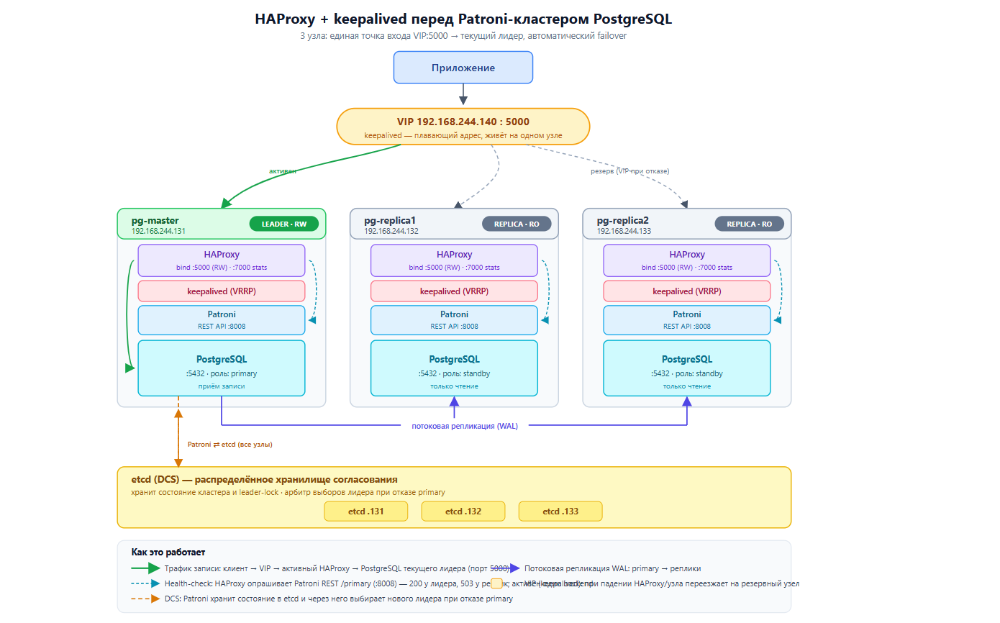

## Курс: OTUS – PostgreSQL для администраторов баз данных и разработчиков
### Проектная работа по теме:
### Создание и тестирование высоконагруженного отказоустойчивого кластера PostgreSQL на базе Patroni

### Цели и задачи:
## 1. Цель - Разработать и развернуть отказоустойчивый кластер PostgreSQL 17

## 2. Задачи:
1. Спроектировать архитектуру кластера
2. Создать и настроить 3 виртуальные машины на ОС Ubuntu
3. Развернуть кластер etcd (3 узла)
4. Установить и подготовить PostgreSQL для дальнейшей настройки Patroni
5. Настроить Patroni для управления PostgreSQL (автоматический failover, репликация, восстановление).
6. Настроить балансировку нагрузки через HAProxy
7. Настроить Keepalived
8. Провести функциональное тестирование кластера (создание БД, репликация, failover).

## 3. Используемые технологии
| Элемент | Версия | Функционал |
| --- | ------- | ----- |
| PostgreSQL | 17.10 | СУБД |
| Patroni | 4.1.3 | Управление кластером PostgreSQL |
| Etcd | 3.5.16 | Распределённое хранилище конфигураций |
| haproxy | Ubuntu 24.04.3 LTS | Операционная система + ВМ |
| VIP PostgreSQL | 2.2.8 | Отказоустойчивый VIP для HAProxy |

## 4. Архитектура кластера

4.1 Компоненты
| Элемент | Адрес | Функционал |
| --- | ------- | ----- |
| pg-master | 192.168.244.131 | Мастер PostgreSQL |
| pg-replica1 | 192.168.244.132 | Реплика PostgreSQL |
| pg-replica2 | 192.168.244.133 | Реплика PostgreSQL |
| etcd | 131/132/133 | 3 узла etcd |
| Keepalived | 192.168.244.140 | Плавающий ip адрес, живет на одной ноде |
| HAProxy | 131/132/133  | Балансировщик |
| Docker + Portainer | 192.168.244.131 | GUI для элементов |

## 5. Настройка linux машин
Единственная проблема, с которой столкнулся при настройке кластера, это меняющийся ip у виртуальных машин, что не очень удобно, поэтому делаем адреса статическими

