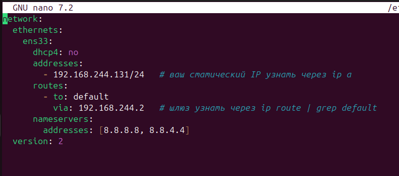
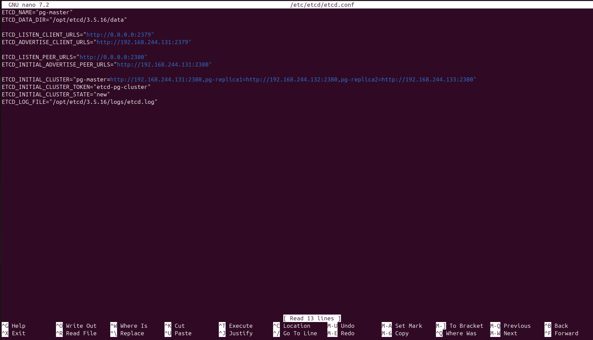
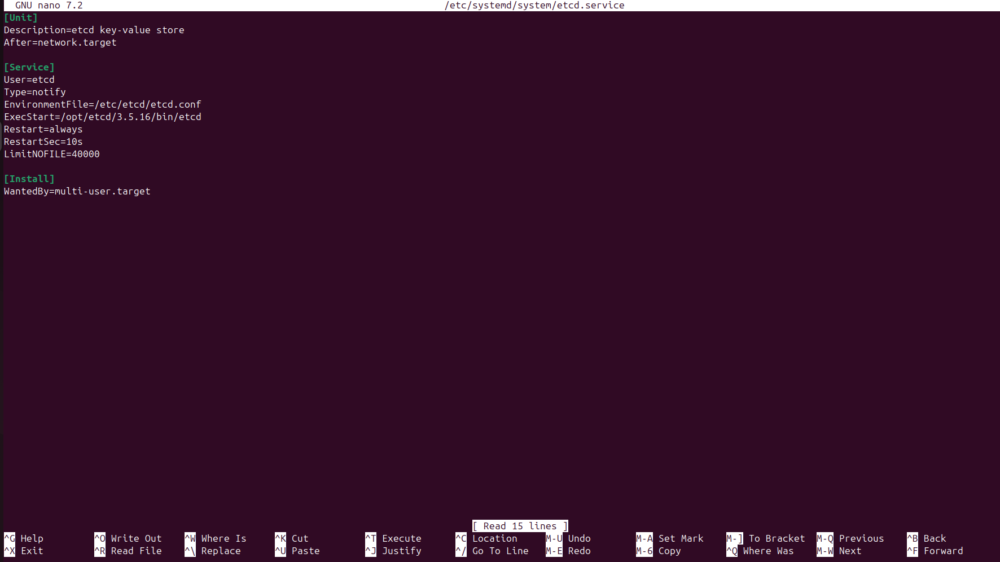
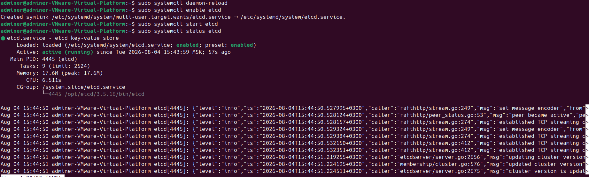

## Курс: OTUS – PostgreSQL для администраторов баз данных и разработчиков
### Проектная работа по теме:
### Создание и тестирование высоконагруженного отказоустойчивого кластера PostgreSQL на базе Patroni

### Цели и задачи:
## 1. Цель - Разработать и развернуть отказоустойчивый кластер PostgreSQL 17

## 2. Задачи:
1. Спроектировать архитектуру кластера
2. Создать и настроить 3 виртуальные машины на ОС Ubuntu
3. Развернуть кластер etcd (3 узла)
4. Установить и подготовить PostgreSQL для дальнейшей настройки Patroni
5. Настроить Patroni для управления PostgreSQL (автоматический failover, репликация, восстановление).
6. Настроить балансировку нагрузки через HAProxy
7. Настроить Keepalived
8. Провести функциональное тестирование кластера (создание БД, репликация, failover).

## 3. Используемые технологии
| Элемент | Версия | Функционал |
| --- | ------- | ----- |
| PostgreSQL | 17.10 | СУБД |
| Patroni | 4.1.3 | Управление кластером PostgreSQL |
| Etcd | 3.5.16 | Распределённое хранилище конфигураций |
| haproxy | Ubuntu 24.04.3 LTS | Операционная система + ВМ |
| VIP PostgreSQL | 2.2.8 | Отказоустойчивый VIP для HAProxy |

## 4. Архитектура кластера


4.1 Компоненты
| Элемент | Адрес | Функционал |
| --- | ------- | ----- |
| pg-master | 192.168.244.131 | Мастер PostgreSQL |
| pg-replica1 | 192.168.244.132 | Реплика PostgreSQL |
| pg-replica2 | 192.168.244.133 | Реплика PostgreSQL |
| etcd | 131/132/133 | 3 узла etcd |
| Keepalived | 192.168.244.140 | Плавающий ip адрес, живет на одной ноде |
| HAProxy | 131/132/133  | Балансировщик |
| Docker + Portainer | 192.168.244.131 | GUI для элементов |

## 5. Настройка linux машин
Единственная проблема, с которой столкнулся при настройке кластера, это меняющийся ip у виртуальных машин, что не очень удобно, поэтому делаем адреса статическими.
Проделываем на каждой ВМ.


Больше ничего настраивать не нужно, в этом и заключается удобство виртуальных машин, все уже есть из коробки.

## 6. Настройка etcd

В общем случае etcd кластер это:
Создать пользователя etcd(1) -> Создать папки и дать права(2) -> Скачать и распаковать бинарники(3)  -> Написать конфиг ноды(4) -> Написать сервисный файл(5) -> Запустить кластер(6)

6.1 Создаем пользователя 
```bash
sudo useradd -r -s /usr/sbin/nologin -M etcd
```
6.2. создаем директории 
```bash
sudo mkdir -p /opt/etcd/3.5.16/{bin,data,logs,scripts}
```
6.3. создаем переменную окружения
```bash
ETCD_VER="v3.5.16"
```
6.4. скачиваем бинарники
```bash
wget https://github.com/etcd-io/etcd/releases/download/${ETCD_VER}/etcd-${ETCD_VER}-linux-amd64.tar.gz
```
6.5. устанавливаем
```bash
tar xzvf etcd-${ETCD_VER}-linux-amd64.tar.gz
```
6.6. перемещаем в нужную директорию
```bash
sudo cp etcd-${ETCD_VER}-linux-amd64/etcd* /opt/etcd/3.5.16/bin/
```
6.7. выдаем права и на запуск
```bash
sudo chmod +x /opt/etcd/3.5.16/bin/*
sudo chown -R root:root /opt/etcd/3.5.16/bin
sudo chown -R etcd:etcd /opt/etcd/3.5.16/data
sudo chown -R etcd:etcd /opt/etcd/3.5.16/logs
```
6.8. бинарники больше не нужны - удаляем
```bash
rm -rf etcd-${ETCD_VER}-linux-amd64 etcd-${ETCD_VER}-linux-amd64.tar.gz
```
6.9. настройка симлинков
```bash
sudo ln -sf /opt/etcd/3.5.16/bin/etcd /usr/local/bin/etcd
sudo ln -sf /opt/etcd/3.5.16/bin/etcdctl /usr/local/bin/etcdctl
```
6.10. Настройка etcd конфига
```bash
sudo mkdir -p /etc/etcd - создаем папку
sudo touch /etc/etcd/etcd.conf
sudo chown root:root /etc/etcd/etcd.conf
sudo chmod 644 /etc/etcd/etcd.conf
sudo nano /etc/etcd/etcd.conf
```



6.11. Cервисный файл, одинаковый для всех нод кластера



Проделываем на всех 3 нодах, подставляя данные настраиваемой ноды

и запускаем etcd на всех 3 нодах
```bash
sudo systemctl daemon-reload
sudo systemctl enable etcd
sudo systemctl start etcd
```

Проверяем
```bash
sudo systemctl status etcd
```


ETCD кластер готов, можно продолжать, но в дополнение установим docker контейнер для удобного отображения etcd и его данных - etcdkeeper.

